# Simple approach to set up a CML project on Git for version control for CML or CDE  Development

## Context: 
If you are using Cloudera machine learning and are setting up your ML Project, and are at a point where you want to set up a git repo for versioning your artifacts as well as collaborating on your project with a broader team, then this tutorial provides you a step by step guide to do so on the Cloudera Machine Learning platform (called CML going forward in the tutorial).

**IMPORTANT WARNING / DISCLAIMER** - These steps will put your code into an external repository, please make sure you understand that you are now publishing your code externally and be aware of copyright and properitory implications through this process. 

## Pre-requisites: 
This tutorial outlines the process of using a public git repository on github. A subsequent
guide will be published on how to follow this process for a private git repo for an organization. Some prerequisites before you start are : 
- You already have an account in Github. If you do not go to github.com and follow the steps to create a new github account
- You have access to a Cloudera Machine Learning platform and are able to access a workspace and create new projects. 

## Additional  References for Documentation
**Cloudera CML Documentation**  
[ Using CML and Git](https://docs.cloudera.com/machine-learning/cloud/projects/topics/ml-using-git.html)

**Github official documentation**
- [Adding locally hosted code to github](https://docs.github.com/en/get-started/importing-your-projects-to-github/importing-source-code-to-github/adding-locally-hosted-code-to-github)
- [Creating a Personal Acccess Token](https://docs.github.com/en/authentication/keeping-your-account-and-data-secure/creating-a-personal-access-token)

## Description 
Git has been one of the go-to choices for developers for versioning, collaboration and CI-CD workflows. If you have been using CML and would like to onboard a project on Git, this guide provides you an easy way to  to setup a remote Github repo. In this guide we will do the following
- **Create a remote github repository**
- **Create a sample cml project**
- **Use simple Github CLI commands to connect to the remote repository in step 1 to push your cml project to the remote repoository**

### **STEP 1 : Create a default CML Project  :** 
- Launch CML from CDP Control pane and select the workspace where would like to set up this demo project for version control   
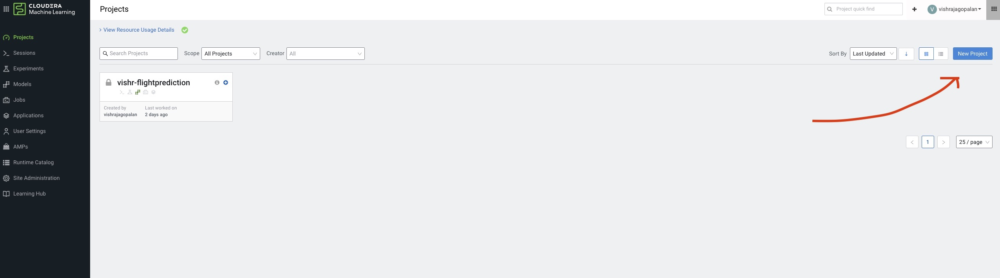   
- After clicking  on the new project enter the details for a sample project    
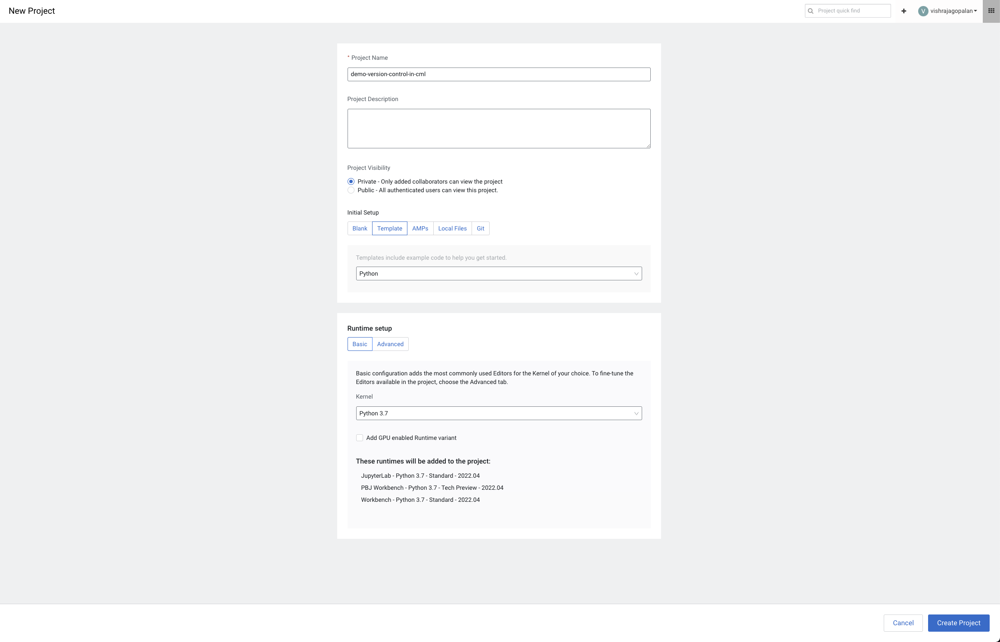   
- This creates a new project with a set of default folders. Check that your folder structure looks like below     
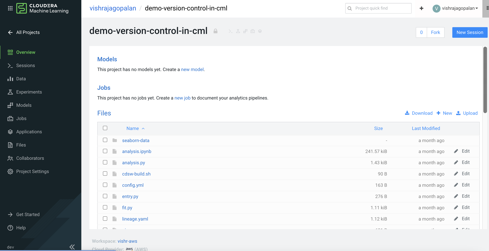   
- Next launch a default session with Workbench and basic configurations    

### **STEP 2 : Setting up the Github repo on Github server**
- Got to www.github.com , sign in with your user id
- On the top right corner click on "+" sign and add Repository   
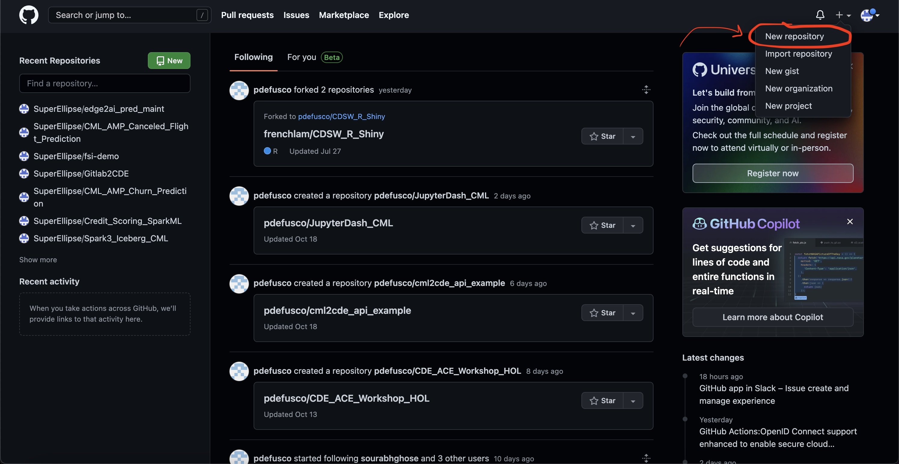   
- Add the repository details as below   
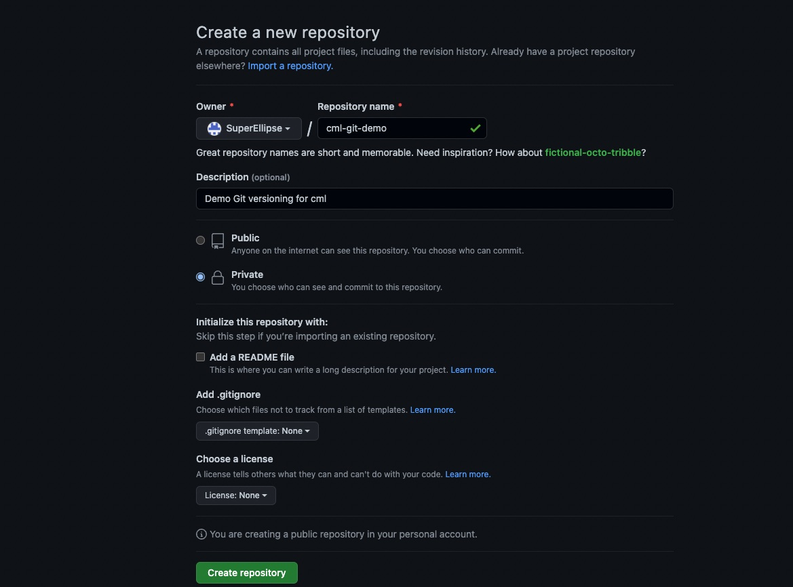   
- After saving the repository, check that you can see the repostory listed in the repo home. Open this repo and copy the path of the repository. Your repoistory should have the format https://github.com/your-user-name/git-version-demo   
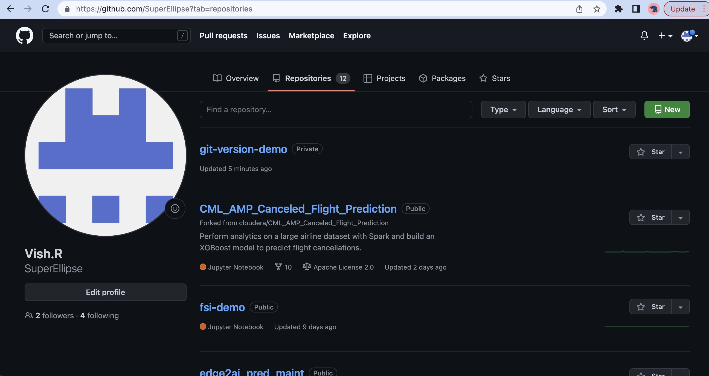   
- Next click on your Github profile icon on the top right to go to Git hub settings  
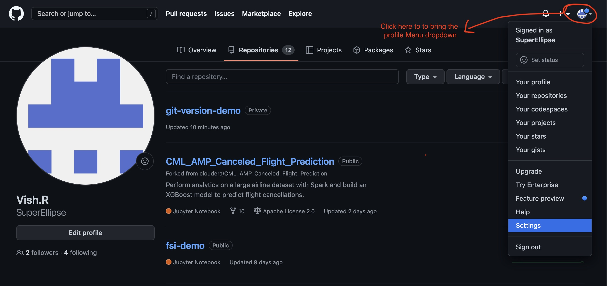   
- Click on menu option and developer settings option   
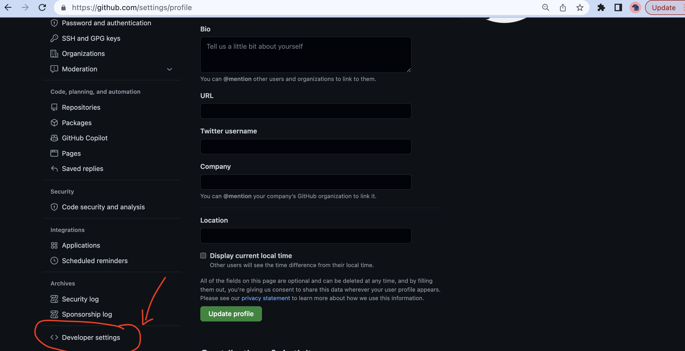   
- Click a new personal access token that you can use to connect to public git from CLI.  
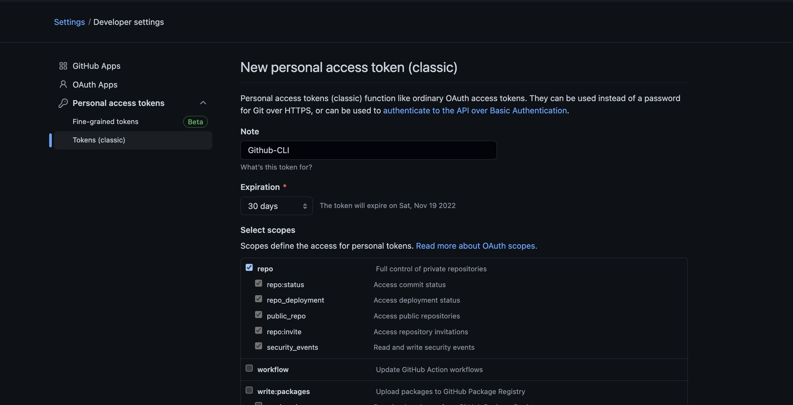
- After you complete the previous step, ake sure you have copied the generated token somewhere  
  

This completes all the steps on the public Github that you needed to do to set up a remote repository. In the next step we will learn how to connect to this repository from Cloudera Machine Learning service. 

### **STEP 3: Use CLI commands to set up CML project on the created remote git repository**
- Return to your project in CML workspace that you had created earlier and start a new session with default settings ( you can use any editor , since we will not be working with the editor , it really does not matter which one you choose)    
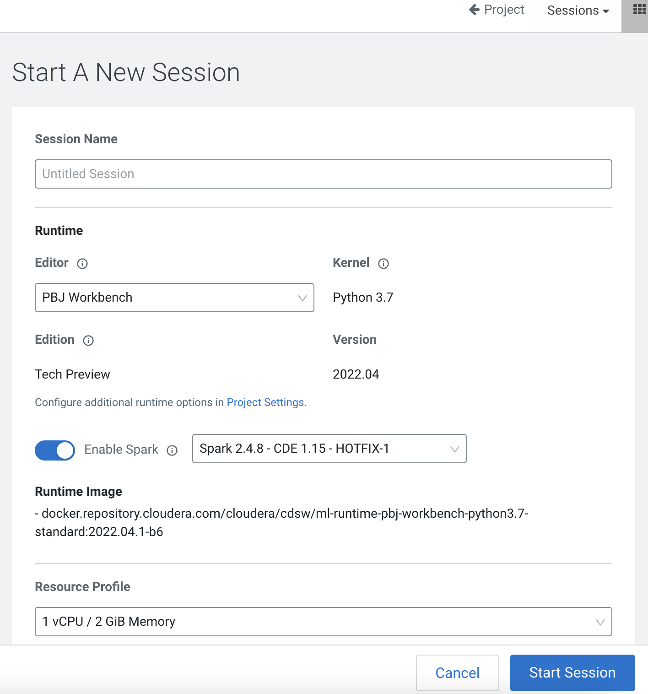   
- Once your session is spun off, click on Terminal access from the top menu to launch a new terminal for your session.    
-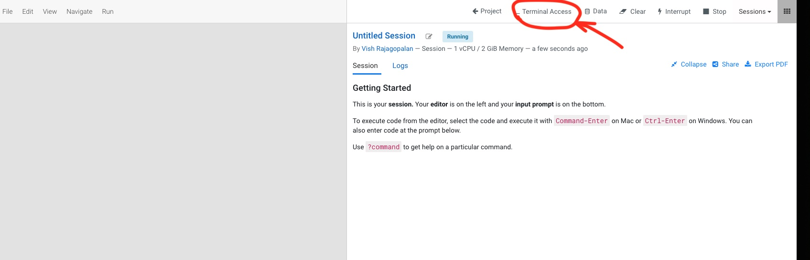   
- Now we will add the current project files shown in the terminal to our remote repository   
-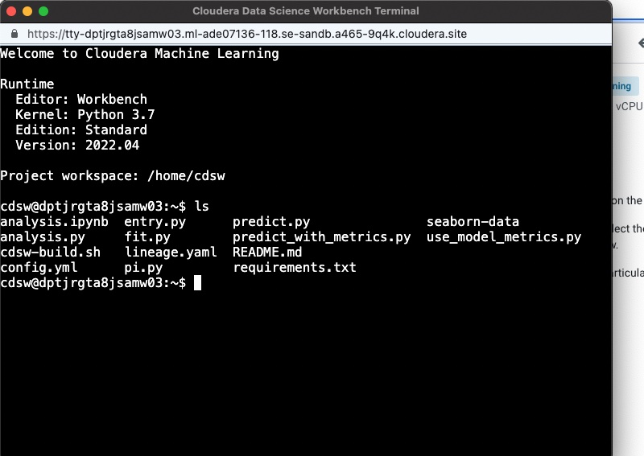   
- Next we will use some commands to push the contents of our local project to the remote repository   

1. Initialize the local repository  
    `git init `
    
2. Use the path to the remote Github repo you copied earlier to set up a remote name for the repo in CML or change the your-github-user-name to your github id you used earlier to create the repo  
    `git remote add origin https://github.com/your-github-user-name/git-version-demo`

3. Let us list the remote repos now  
`git remote -v`

4. Finally get the status of the repo. This gives us the list of files in the project that we would now like to add to our remote repository. Git commands can be used to ignore certain files as well, but for now well add all these files. 
`git status`    
Below is the output you should see after running these commands on terminal at the end of step 4   
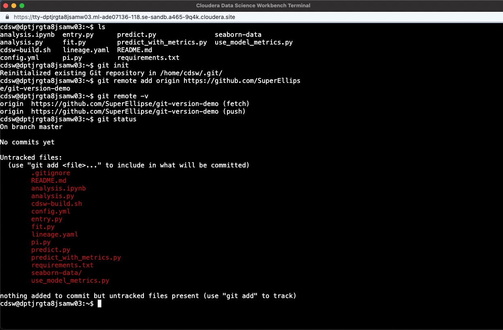

5. Next let us add all these files for version tracking and make our first commit  
`git add .`  
`git commit -a -m "first git commit"`  
Below is the output after running these commands that you can refer to.
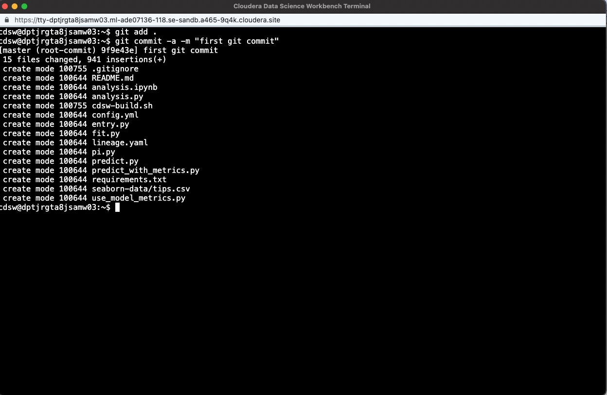
6. Finally you need to create a branch called main and  push these commited files to the main branch  
`git branch -m main` 
`git push origin main` 
you will be asked to login to your Gitaccount. Use your userid and the personalized access token that you copied to enter here. The output looks like this.  
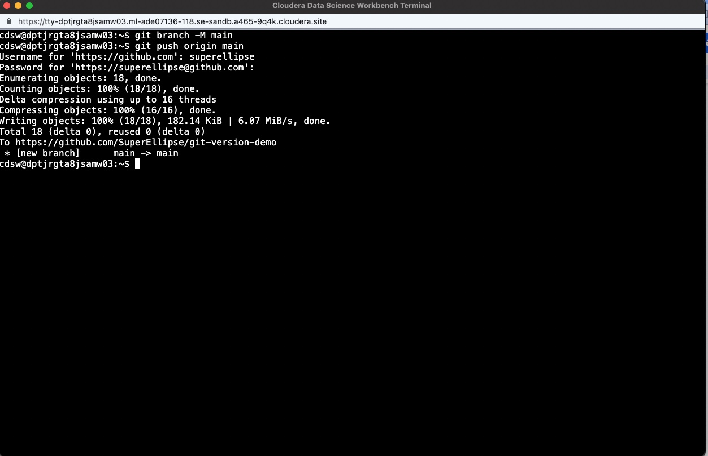   
7. Finally, as a last step we will go back to the github public repo to check if our changes are indeed pushed to the repo. here is the output of the earlier empty repository , which now contains my CML project.   
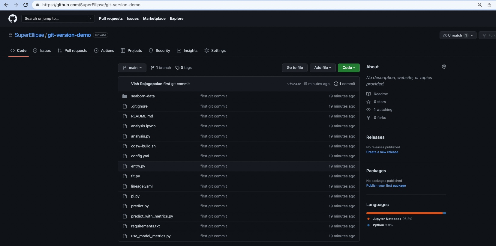  

## Summary
in this guide,  we learnt how to add an existing code artifacts in Cloudera Machine Learning Platform that you would create as a part of your Machine Learning workflow or for Spark jobs on CDE to a repository on a public github. Github provides a large set of commands that can be used on CML Command line terminal for working with your remote repository. For more information check out additional documentation on github.com

 

